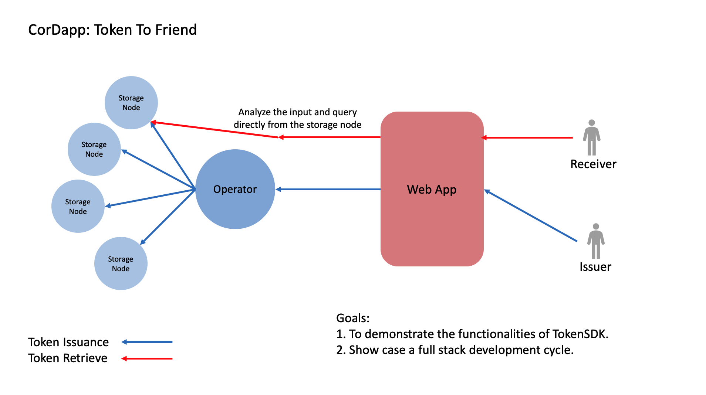

# Token To Friend
In this Cordapp, you will be able to create a token and attached a few message strings. You can later retrieve the token and the strings via query. 

## Concept
We have built a front end interface to make the interaction easier. Clone the app and give a try! 
<p align="center">
  
</p>

## Commands
1. NSD:
 ```
flow start CreateNewAccount acctName: Radmir
flow start FiatCurrencyIssueFlow currency: RUB, amount: 100000, recipient: Radmir
 ```
2. Example Org:
 ```
flow start CreateNewStockFlow symbol: test, name: Loan, currency: RUB, price: 10000.0, issueVol: 20
run vaultQuery contractStateType: com.r3.corda.lib.tokens.contracts.states.FungibleToken
 ```
3. NSD:
 ```
flow start IssueStockToken uuid: a1e83e2d-65f6-4e9b-b80c-85292a96b938
run vaultQuery contractStateType: net.corda.nrd.states.StockState // Получение всех аппрувнытых токенов
flow start MoveStockToken quantity: 3, recipient: Radmir, uuid: a1e83e2d-65f6-4e9b-b80c-85292a96b938
flow start ShareAccountTo acctNameShared: Radmir, shareTo: ExampleOrg
 ```
```
flow start GetStockTokenBalance uuid: 5b63e56b-d975-4ab0-a5ac-4e5a2337b285

flow start QueryToken recipientEmail: Radmir, uuid: 5b63e56b-d975-4ab0-a5ac-4e5a2337b285
``` 

 ## Running the applications 
 ```
 ./gradlew deployNodes
 ./build/nodes/runnodes
 ```
 
 ## Running in terminal: 
 Go to the operator node: 
 ```
 flow start CreateMyToken myEmail: 1@gmail.com, recipients: 2@gmail.com, msg: Corda Number 1! 

 ```
 then record the returned uuid
 ```
 flow start IssueToken uuid: xxx-xxxx-xxxx-xxxx-xx
 ```
 record the message returned, TokenId and storage node.
 
 Go to that storage node terminal: 
 ```
 flow start QueryToken uuid: xxx-xxxx-xxxx-xxxx-xx, recipientEmai: 2@gmail.com
 ```
 
You should discover the message that was attached in the token. 

## Runing in webapp
Open a new window and run the blow code for token issuance
```
./gradlew runOperatoreServer
```
To retrieve the token, because most people will run the app locally, by default I have the gradle task to start only one storage node's web server. 
```
./gradlew runUSWest1Server
```
After both servers started, go to localhost:10050 to issue a token and localhost:10053 to experience the retrieve. (The reason it is two different site is that communiticating among multiple local server is prohibit by CORS policy. In production environment, we do not need to go to a different site for retrieve.)


